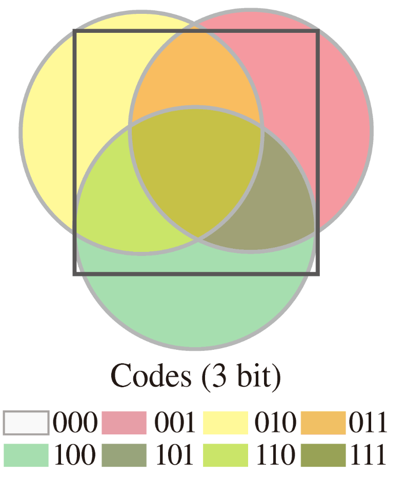
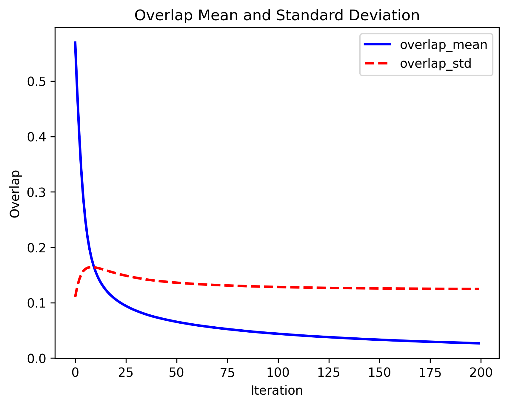
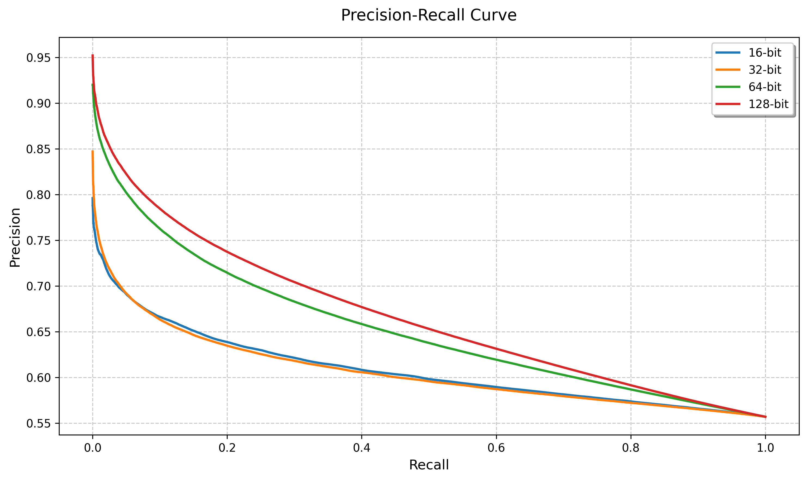
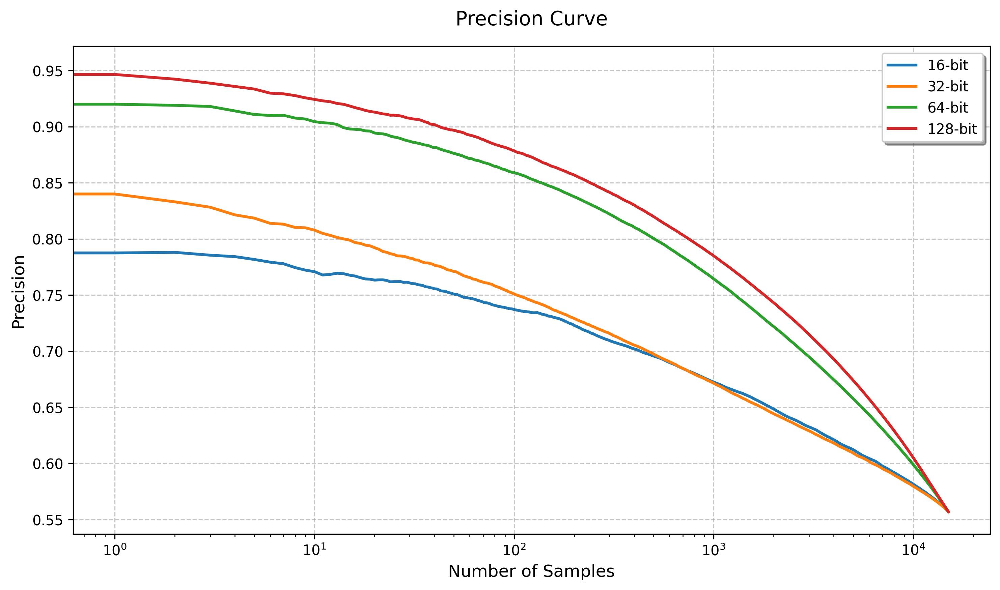
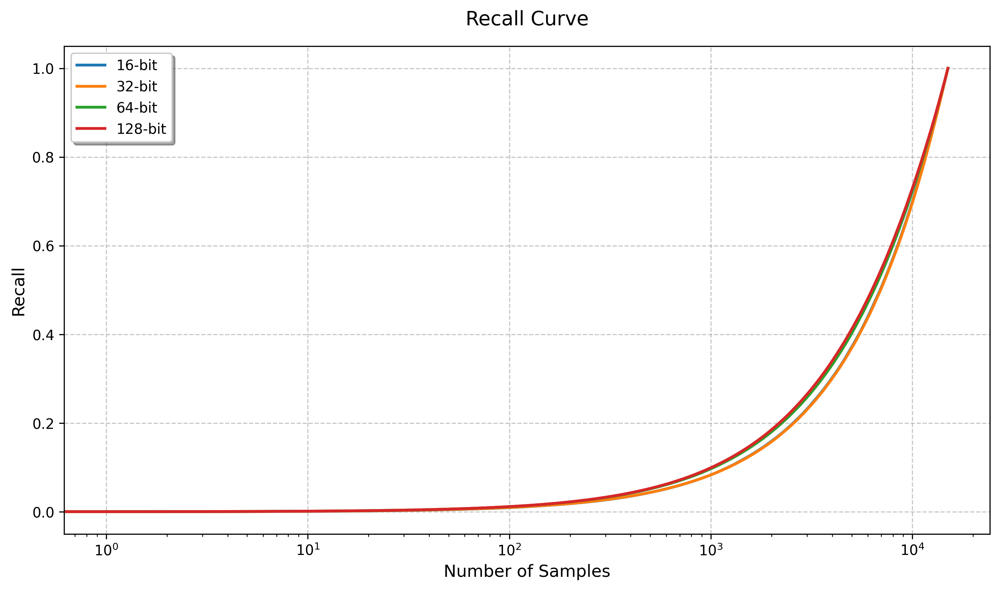
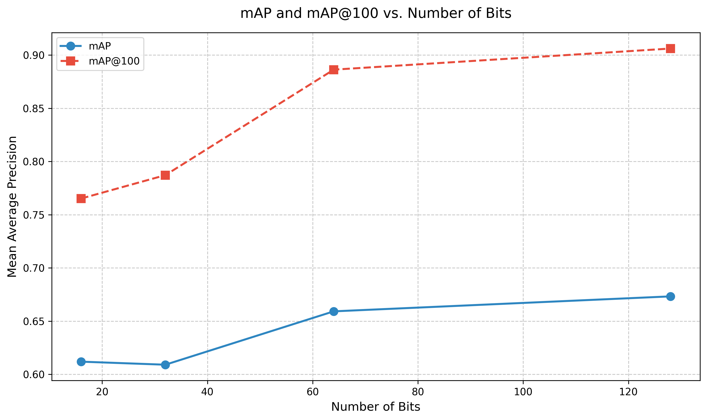
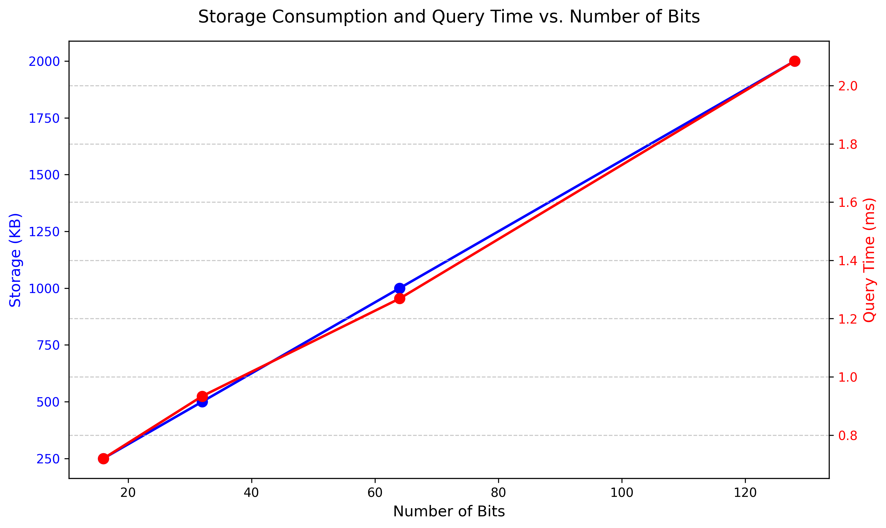

# DIA Lab1：基于球面哈希的图像检索

## 摘要

本实验旨在探讨基于球面哈希（Spherical Hashing）的图像检索技术。通过对包含 16,000 张图像的数据库进行实验，我们利用球面哈希算法训练二值哈希函数，将图像的 768 维视觉特征向量二值化。本研究分别测试了 16、32、64 和 128 比特哈希码的检索性能，并使用平均精度均值 (`mAP`)、Recall@K 曲线、Precision@K 曲线来评估检索性能，同时评估了数据库特征存储消耗和每张图像的平均检索时间。实验结果表明，球面哈希在不同比特数下均能实现高效且稳定的图像检索性能。

## 1. 引言

随着数字图像的爆炸式增长，如何高效地检索大规模图像数据库成为计算机视觉领域的一大挑战。传统的基于树的近邻搜索技术在高维数据面前面临可伸缩性问题。二值编码嵌入技术，通过将高维数据点编码为紧凑的二值码，提供了一种高效的相似性搜索和数据表示方法。现有的二值编码方法大多采用基于超平面的哈希函数来划分数据。然而，球面哈希作为一种新颖的基于超球面的哈希函数，能够将空间上更连贯的数据点映射到二值码中，从而定义更紧密的封闭区域。

本作业旨在应用球面哈希算法，对给定图像数据库中的图像进行检索。我们将详细介绍所采用的方法、实验设置，并分析在不同哈希比特数下的检索性能和效率。

## 2. 方法

### 2.1 球面哈希原理

球面哈希通过定义一系列超球面来将高维数据点映射到二值码。

$$
\mathcal{H}: \mathbb{R}^d \rightarrow \{0,1\}^l
$$

每个球面哈希函数 $h_i(x)$ 由一个球心 $p_i$ 和一个距离阈值 $t_i$ 定义。

$$
h_i(x)=
\begin{cases}
1, & \text{if } d(p_i,x)\leq t_i\\
0, & \text{if } d(p_i,x)>t_i
\end{cases}
$$

该方法的核心在于迭代优化过程，以实现每个哈希函数的平衡划分以及哈希函数之间的独立性。

- 平衡划分是指每个哈希函数将样本空间大致均分为两部分，即球内和球外的样本数量各占一半。
- 独立性则意味着不同哈希函数产生的二值码位之间应尽可能不相关。

**迭代优化步骤：**

1. **初始化：** 从训练样本 $\mathcal{X}=\{x_1,x_2,...,x_n\}$ 中随机选择 $l$ 个点作为初始球心 $p_1,p_2,...,p_l$。

2. **确定半径：** 对于各个球心，确定半径 $t_1,t_2,...,t_l$，使得球内的样本数 $o_l$ 占总样本数 $n$ 的一半，即 $o_l=\frac{n}{2}$。

3. **计算** $o_{ij}$**：** 对于每对哈希函数 $i$ 和 $j$，计算数据点同时在 $i$ 和 $j$ 哈希球半径内的个数
   
   $$
   o_{ij}=\{x_k|h_i(x_k)=+1,h_j(x_k)=+1,1<k<n\}
   $$

4. **计算偏移量** $f_i$**：** 对于所有的 $i$ 和 $j$，计算相互作用力：
   $$
   f_{i\leftarrow j}=\frac{2}{n}(\frac{o_{ij}}{4}-\frac{n}{4})(p_i-p_j)
   $$
   累计力 $f_i$ 是所有其他球心作用于 $p_i$ 的平均力。

5. **循环：** 重复步骤 2-4，直至收敛。收敛条件是 $o_{ij}$ 的平均值和标准差满足预设的误差容限：
   $$
   \begin{aligned}
   &&\text{avg}(|o_{ij}-\frac{n}{4}|)\leq\frac{n}{4}\epsilon_m\\
   &&\text{std-dev}(o_{ij})\leq\frac{n}{4}\epsilon_s
   \end{aligned}
   $$

### 2.2 代码实现

本项目使用 Python 实现，主要包含以下文件：

1. `spherical_hashing.py`: 实现了 `SphericalHashing` 类，主要负责球面哈希的训练和哈希码的生成。

2. `main.py`: 主程序，负责球面哈希的训练和检索性能评估。

3. `evaluation.py`: 评估模块，包含计算 `mAP` 和 PR 曲线、评估存储消耗和查询时间。

### 2.3 距离度量

传统的二值码嵌入方法通常使用汉明距离 (Hamming distance) 来衡量两个二值码之间的相似性。然而，球面哈希提出了一种更适合其特性的距离函数：**球面汉明距离 (Spherical Hamming distance, SHD)**。

球面汉明距离的定义为：

$$
d_{SHD}(b_i,b_j)=\frac{|b_i\oplus b_j|}{|b_i\wedge b_j|}
$$
其中，$|b_i\oplus b_j|$ 表示两个二值码不同位的数量（异或操作），而 $|b_i\wedge b_j|$ 表示两个二值码中共同为 +1 的位的数量（与操作）。分母中的共同 +1 位数反映了数据点同时落在多少个超球体内部，这对于衡量由超球体定义的紧密区域非常重要。在实际实现中，为避免除零，分母会加上一个很小的常数（例如 0.1）。

### 2.4 检索性能评价指标

本报告采用以下指标评价检索性能：

- **平均精度均值 (mAP, mean Average Precision)：** 综合评价检索结果的精确度和召回率。mAP 的计算公式为：

  $$
  mAP=\frac{1}{N_q}\sum_{i=1}^{N_q}\frac{1}{N_i}\sum_{k=1}^{N}precision@k\cdot rel(i,k)
  $$
  其中，$N_q$ 是查询图像数量，$N_i$ 是第 $i$ 个查询图像的与数据库中相关图像总数，$N$ 是检索数据库图像总数，$rel(i,k)$ 表示第 $k$ 个检索结果与第 $i$ 个查询图像是否相关 (0 或 1)。

- **Recall@K 曲线：** 显示在返回前 K 个检索结果时，召回率的变化趋势。Recall@K 的计算公式为：

  $$
  recall@K=\frac{1}{N_q}\sum_{i=1}^{N_q}\frac{1}{N_i}\sum_{k=1}^{K}rel(i,k)
  $$

- **Precision@K 曲线：** 显示在返回前 K 个检索结果时，精确率的变化趋势。Precision@K 的计算公式为：
  $$
  Precision@K=\frac{1}{N_q}\sum_{i=1}^{N_q}\frac{1}{K}\sum_{k=1}^{K}rel(i,k)
  $$
  

### 2.5 检索效率评价指标

为了评估检索效率，我们关注以下两点：

- **数据库特征存储消耗：** 以 KB 为单位，衡量存储数据库图像二值哈希特征所需的空间。
- **每张图像平均检索时间：** 衡量检索一张查询图像的平均耗时。

## 3. 实验设置

### 3.1 数据集

本实验使用的数据集是 **MIRFLICKR25K** 的子集。数据集以 `data.npz` 文件形式提供，包含 16,000 张图像的特征向量、标签和相对路径。

- `features` (`arr_0`)：形状为 (16000,768)，表示图像的 768 维视觉特征。
- `labels` (`arr_1`)：形状为 (16000,38)，表示图像的 38 类标签。如果两张图像具有某个相同的标签，则它们被认为是相关图像。
- `image_paths` (`arr_2`)：形状为 (16000,)，表示图像的相对路径。

### 3.2 数据集划分

- **查询图像：** 前 1000 张图像 (`features[:1000]`) 作为查询集。
- **检索数据库图像：** 后 15000 张图像 (`features[1000:]`) 作为检索数据库。
- 标签也相应地划分为查询标签和数据库标签，并转换为布尔类型以方便处理相关性。

### 3.3 实验参数

实验使用 Python 语言实现，主要依赖以下库：`numpy`、`cupy`、`scipy`、`tqdm`、`matplotlib`

在实验开始前，我们选择了 bit=64 的哈希函数，寻找合适的超参数。

- **哈希比特数：** 分别测试 16、32、64、128 bit
- **最大迭代次数：** `max_iter = 200`
- **收敛误差阈值：**
  - `epsilon_mean = 0.1` (平均值误差)
  - `epsilon_stddev = 0.15` (标准差误差)
- **重叠比率：** `overlap_ratio = 0.25`。

## 4. 实验结果与分析

我们针对 16、32、64、128 比特哈希码进行了球面哈希训练和检索性能评估。

### 4.1 Precision-Recall 曲线分析

下图展示了不同比特数下的 Precision-Recall 曲线。

     

从图中可以观察到：

- 所有比特数的曲线都呈现出典型的 PR 曲线特征，即在召回率较低的区域保持较高的精确率。随着召回率的增加，精确率逐渐下降。
- 随着比特数增加，精确率曲线和召回率曲线都向右上角移动，说明随着比特数增加，查询的精度提升明显。
- 在召回率较低的区域，精确率曲线和召回率曲线都较高，说明在召回率较低的区域，查询的精度较高。

### 4.2 mAP 和 mAP@100 分析

以下表格汇总了不同比特数下的 `mAP` 和 `mAP@100` 指标：

| **比特数** | **`mAP`** | **`mAP@100`** |
| ---------- | --------- | ------------- |
| 16         | 0.6146    | 0.7713        |
| 32         | 0.6071    | 0.7952        |
| 64         | 0.6647    | 0.8858        |
| 128        | 0.6735    | 0.9070        |

分析结果：

- **`mAP` 表现：** `mAP` 值在 0.60-0.67 之间波动，整体表现稳定,但随着比特数增加，`mAP` 值有明显提升，特别是在 64 比特和 128 比特时提升显著
- **`mAP@100` 表现：** 与 `mAP` 相比，`mAP@100` 表现出更明显的提升趋势，随着比特数增加，`mAP@100` 值提升明显，从 16 比特的 0.7713 提升到 128 比特的 0.9070

`mAP` 的结果与 PR 曲线一致，随着比特数增加，查询的精度提升明显。

### 4.3 存储消耗和查询时间分析

以下表格汇总了不同比特数下的存储消耗和平均检索时间：

| **比特数** | **存储消耗 (KB)** | **平均检索时间 (秒)** |
| ---------- | ----------------- | --------------------- |
| 16         | 250.00           | 0.0007                |
| 32         | 500.00           | 0.0009                |
| 64         | 1000.00          | 0.0013                |
| 128        | 2000.00          | 0.0020                |

1. **存储效率：** 存储消耗与比特数呈严格的线性关系
2. **查询效率：** 查询时间随比特数增加而略微增加，即使在最高比特数（128）的情况下，平均查询时间也仅为 2.0 毫秒

## 5. 结论

本实验成功地探讨了基于球面哈希（Spherical Hashing）的图像检索技术在大规模图像数据库中的应用。通过对包含 16,000 张图像的 **MIRFLICKR25K** 数据集进行实验，我们评估了不同比特数（16、32、64 和 128 比特）下的检索性能和效率。

本实验结果表明，球面哈希在不同比特数下均能实现高效且稳定的图像检索性能。随着比特数的增加，检索精度显著提升，特别是在 `mAP@100` 指标上表现尤为明显。同时，球面哈希在存储消耗和查询时间方面也表现出色，能够有效地处理大规模图像数据库的检索需求。

## 6. 参考文献

1. Heo, J. P., Lee, Y., He, J., Chang, S. F., & Yoon, S. E. (2012). Spherical hashing. In Proceedings of the IEEE Conference on Computer Vision and Pattern Recognition (pp. 2957-2964).
2. Heo, J. P., Lee, Y., He, J., Chang, S. F., & Yoon, S. E. (2015). Spherical hashing: Binary code embedding with hyperspheres. *IEEE transactions on pattern analysis and machine intelligence*, *37*(11), 2304-2316.