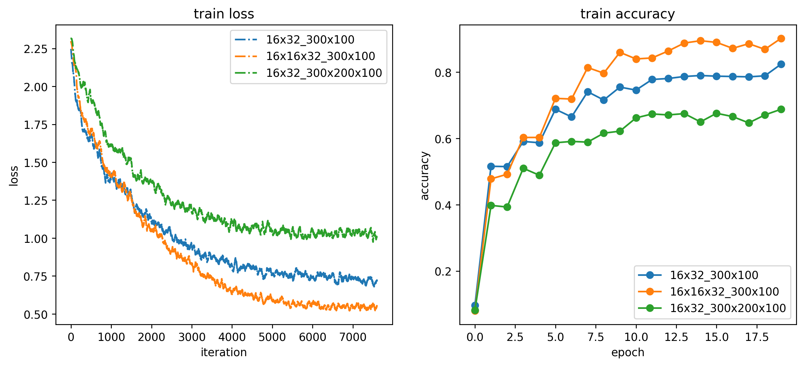
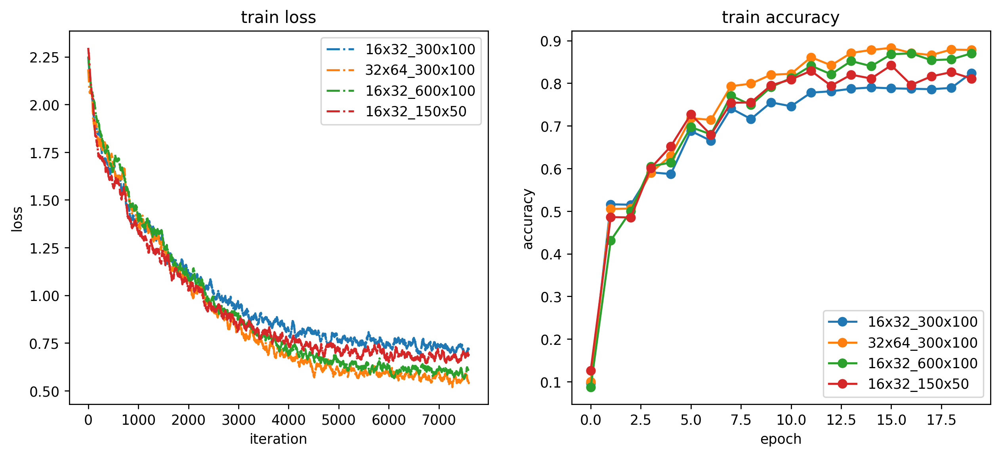
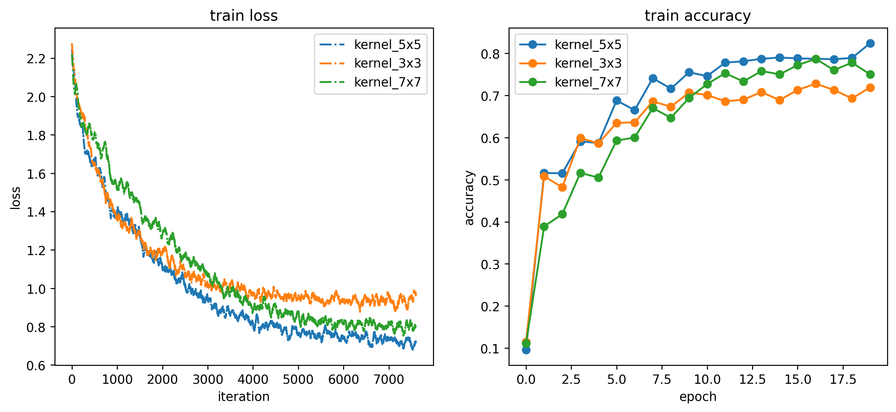

# DIA Lab2: 基于卷积神经网络的图像分类

> SA24229016, 王润泽

## 1. 任务说明

本实验的主要任务是搭建一个简单的卷积神经网络，实现图像分类功能。具体包括：

1. **网络层实现**：完成构成卷积神经网络的主要网络层的前向和反向计算，包括：
   - 卷积层（Convolution Layer）
   - 激活函数（ReLU）
   - 汇聚层（Max Pooling）
   - 全连接层（Affine Layer）
   - 损失函数（Softmax Loss）

2. **网络架构搭建**：构建一个简单的卷积神经网络，主要结构为：
   ```
   {conv-relu}×M - 2×2 max pool - {affine-relu}×(L-1) - affine - softmax
   ```
   其中 `{conv-relu}` 有M个，`{affine-relu}` 有L-1个，整个网络为 M+L 层。

3. **实验优化**：通过调整网络结构参数，提高分类准确率。

## 2. 实验原理

### 2.1 卷积神经网络基本原理

卷积神经网络（CNN）是一种专门用于处理具有网格结构数据的深度学习模型，特别适用于图像分类任务。CNN的核心思想是通过局部连接、权重共享和空间降采样来减少参数数量并提高计算效率。

### 2.2 主要网络层原理

#### 2.2.1 卷积层（Convolution Layer）
卷积层是CNN的核心组件，通过滑动窗口的方式提取图像的局部特征。

**前向传播**：

```python
def conv_forward_naive(x, w, b, conv_param):
    N, C, H, W = x.shape
    F, _, HH, WW = w.shape
    stride = conv_param.get('stride', 1)
    pad = conv_param.get('pad', 0)
    H_out = 1 + (H + 2 * pad - HH) // stride
    W_out = 1 + (W + 2 * pad - WW) // stride
    out = np.zeros((N, F, H_out, W_out))    
    for i in range(H_out):
        for j in range(W_out):
            h_start = i * stride
            h_end = h_start + HH
            w_start = j * stride
            w_end = w_start + WW
            out[:, :, i, j] = np.sum(x[:, :, h_start:h_end, w_start:w_end] * w, axis=(1, 2, 3))
            out[:, :, i, j] += b
    return out
```

其中：

- H, W：输入图像的高度和宽度
- HH, WW：卷积核的高度和宽度
- pad：填充大小
- stride：步长

**反向传播**：
通过链式法则计算梯度，卷积的反向传播实际上是转置卷积操作。

```python
def conv_backward_naive(dout, cache):
    dx, dw, db = None, None, None
    x, w, b, conv_param = cache
    stride = conv_param['stride']
    pad = conv_param['pad']
    N, C, H, W = x.shape
    F, _, HH, WW = w.shape
    _, _, H_out, W_out = dout.shape

    x_padded = np.pad(x, ((0,0), (0,0), (pad,pad), (pad,pad)), mode='constant')
    dx_padded = np.zeros_like(x_padded)
    dw = np.zeros_like(w)
    db = np.zeros_like(b)

    # db: sum over N, H_out, W_out
    db = np.sum(dout, axis=(0,2,3))

    for n in range(N):
        for f in range(F):
            for i in range(H_out):
                for j in range(W_out):
                    h_start = i * stride
                    h_end = h_start + HH
                    w_start = j * stride
                    w_end = w_start + WW
                    window = x_padded[n, :, h_start:h_end, w_start:w_end]
                    dw[f] += window * dout[n, f, i, j]
                    dx_padded[n, :, h_start:h_end, w_start:w_end] += w[f] * dout[n, f, i, j]
    # Remove padding from dx_padded
    dx = dx_padded[:, :, pad:pad+H, pad:pad+W]
    return dx, dw, db
```


#### 2.2.2 激活函数（ReLU）
ReLU（Rectified Linear Unit）函数定义为：
```python
f(x) = max(0, x)
```

**前向传播**：直接应用max函数
**反向传播**：梯度为1（当x > 0时）或0（当x ≤ 0时）

#### 2.2.3 最大汇聚层（Max Pooling）
最大汇聚层用于降低特征图的空间维度，提取最显著的特征。

**前向传播**：在每个汇聚窗口中选择最大值
```python
max_pool = np.max(x[n, c, h_start:h_end, w_start:w_end])
```
**反向传播**：梯度只传递给前向传播中最大值对应的位置
```python
dout[n, c, i, j] = 1 if x[n, c, h_start:h_end, w_start:w_end] == max_pool else 0
```

#### 2.2.4 全连接层（Affine Layer）
全连接层将特征映射到分类空间。

**前向传播**：`y = Wx + b`
**反向传播**：`dW = x^T × dy`, `db = sum(dy)`, `dx = dy × W^T`

#### 2.2.5 Softmax损失函数
Softmax函数将原始分数转换为概率分布：
```python
P(y_i) = exp(x_i) / sum(exp(x_j))
```

损失函数为交叉熵损失：
```python
L = -log(P(y_true))
```

## 3. 实现细节

实验在 Ubuntu 20.04 系统上进行，使用 `python 3.10` 环境，使用 `numpy` 和 `cupy` 库实现卷积层和全连接层的前向和反向传播。主要代码:
- `cs231n/layers.py` 实现 Naive CPU版本的卷积层和全连接层的前向和反向传播。
- `cs231n/fast_layers.py` 实现 Cupy GPU版本的卷积层和全连接层的前向和反向传播。
- `cs231n/classifiers/cnn.py` 实现卷积神经网络的训练和测试。
- `cs231n/main.py` 实现卷积神经网络的主要训练代码。
- `cs231n/run.sh` 实现卷积神经网络的训练和测试脚本。
- `cs231n/draw.ipynb` 后续用于测试和绘图结果。

### 3.1 数据集
本实验采用CIFAR-10数据集，包含10个类别的32×32彩色图像：
- 训练集：49,000张图像
- 验证集：1,000张图像  
- 测试集：1,000张图像

### 3.2 网络架构实现

#### 3.2.1 基础网络结构
```python
class MultiLayerConvNet:
    def forward(self, X):
        M = len(conv_param)
        L = len(affine_param)
        caches = []
        out = X
        for i in range(M):
            out, cache = conv_relu_forward(out, W, b, conv_param)
            caches.append(cache)
            if i == M-1:
                out, cache = max_pool_forward_fast(out, pool_param)
                caches.append(cache)
        for i in range(L):
            if i == L-1:
                out, cache = affine_forward(out, W, b)
            else:
                out, cache = affine_relu_forward(out, W, b)
            caches.append(cache)
        caches.append(cache)
        return out, caches
```

网络结构：
- 输入：3×32×32的彩色图像
- 卷积层：使用ReLU激活函数
- 最大汇聚层：2×2窗口，步长为2
- 全连接层：使用ReLU激活函数
- 输出层：Softmax分类

### 3.3 训练策略

- **优化器**：Adam优化器
- **学习率**：2e-3
- **批次大小**：50
- **正则化**：L2正则化，强度为0.001

## 4. 实验结果

Baseline网络结构采用：`(16,32)` 卷积核为5×5的卷积层，`(300,100)` 全连接层，分类数为10。

### 4.1 网络深度对比实验

比较不同网络深度对分类性能的影响：

| 网络架构 | 卷积层配置 | 全连接层配置 | 测试准确率 |
|---------|-----------|-------------|-----------|
| baseline | 16, 32 | 300, 100 | 0.636 |
| arch_3conv_2fc | 16, 16, 32 | 300, 100 | 0.613 |
| arch_2conv_3fc | 16, 32 | 300, 200, 100 | 0.600 |



**分析**：
- 增加卷积层深度（3层vs2层）虽然在训练集上表现更好，但在测试集上表现更差，可能由于过拟合或梯度消失
- 增加全连接层深度（3层vs2层）并没有带来性能提升，反而导致过拟合。
- baseline架构在深度实验中表现最佳，可能是因为baseline架构的参数较少，而较深的网络架构在没有残差连接，Batch Normalization等技术的情况下，更容易过拟合。

### 4.2 网络宽度对比实验

比较不同网络宽度对分类性能的影响：

| 网络架构 | 卷积层配置 | 全连接层配置 | 测试准确率 |
|---------|-----------|-------------|-----------|
| baseline | 16, 32 | 300, 100 | 0.636 |
| conv_wider | 32, 64 | 300, 100 | 0.640 |
| fc_wider | 16, 32 | 600, 100 | 0.616 |
| fc_narrower | 16, 32 | 150, 50 | 0.622 |



**分析**：
- 增加卷积层宽度（32×64 vs 16×32）在训练集和测试集上表现都更好
- 增加全连接层宽度（600×100 vs 300×100）虽然在训练集上表现更好，但在测试集上表现更差，可能由于过拟合
- 减少全连接层宽度（150×50 vs 300×100）在训练集和测试集上表现都更差
- 卷积层宽度的增加比全连接层宽度的调整更有效，可能是因为卷积层能够更好地提取空间特征，而全连接层则更容易过拟合。

### 4.3 卷积核大小对比实验

比较不同卷积核大小对分类性能的影响：

| 网络架构 | 卷积核大小 | 测试准确率 |
|---------|-----------|-----------|
| kernel_5x5 | 5×5 | 0.636 |
| kernel_3x3 | 3×3 | 0.589 |
| kernel_7x7 | 7×7 | 0.573 |



**分析**：
- 5×5卷积核表现最佳
- 3×3卷积核感受野较小，可能无法捕获足够的特征
- 7×7卷积核感受野过大，可能导致过拟合
- 中等大小的卷积核（5×5）在CIFAR-10数据集上表现最优

### 4.4 综合性能分析

**最佳配置**：
- 网络架构：2个卷积层（32, 64）+ 2个全连接层（300, 100）
- 卷积核大小：5×5
- 测试准确率：64.0%

**关键发现**：
1. 适度的网络宽度比深度更重要
2. 卷积层宽度的增加比全连接层更有效
3. 中等大小的卷积核（5×5）最适合CIFAR-10数据集
4. 过深的网络容易导致过拟合

## 5. 总结

### 5.1 实验结果

本实验成功实现了：
1. 完整的CNN各层前向和反向传播算法
2. 基于CIFAR-10数据集的图像分类任务
3. 系统性的网络架构对比实验

### 5.2 主要结论

1. **网络深度**：在CIFAR-10数据集上，2层卷积+2层全连接的架构表现最佳，过深的网络容易过拟合。

2. **网络宽度**：增加卷积层的宽度比增加全连接层的宽度更有效，这可能是因为卷积层能够更好地提取空间特征。

3. **卷积核大小**：5×5的卷积核在CIFAR-10数据集上表现最佳，平衡了感受野大小和参数数量。

### 5.3 可能改进方向

1. **数据增强**：引入数据增强技术（旋转、翻转、裁剪等）提高模型鲁棒性
2. **批归一化**：添加批归一化层加速训练并提高性能
3. **残差连接**：引入残差连接解决深层网络的梯度消失问题
4. **学习率调度**：实现更复杂的学习率调度策略

### 5.4 实验意义

本实验深入理解了CNN的基本原理和实现细节，通过系统性实验验证了不同网络架构对分类性能的影响，为后续的深度学习研究奠定了坚实基础。实验结果表明，在图像分类任务中，网络架构的设计需要综合考虑数据集特点、计算复杂度和模型性能的平衡。 